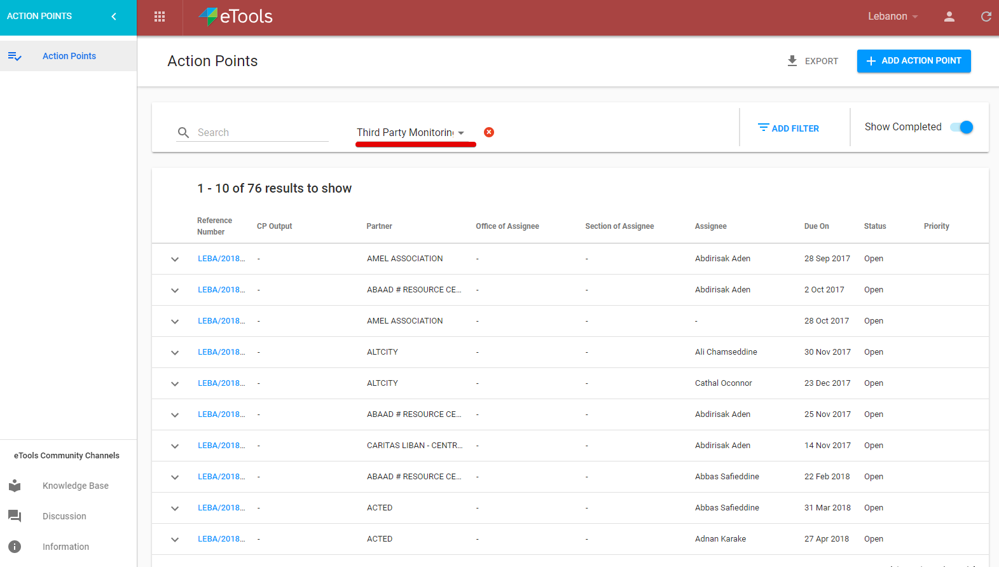
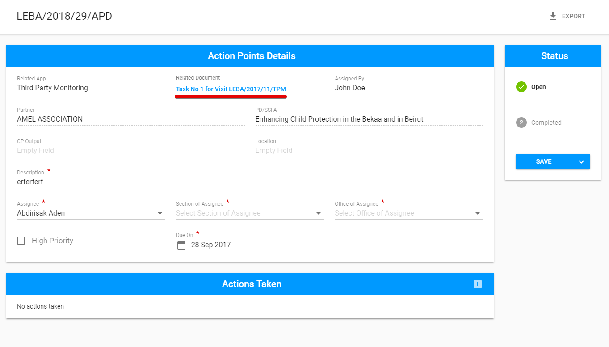

# Third Party Monitoring Module Navigation

### There are 3 ways to access the TPM.

## **1\)** via the app icon 

 User can switch to the TPM by selecting “Third Party Monitoring” module icon:

## 2\) via the direct link link 

The user can access the TPM via the link in the email to a **particular visit** which is accessed to him or via a link for **signing in** TPM.

## 3\) **via the Action Point Dashboard** \(through the link to AP created in TPM\)

1\) The user should switch to Action Point Dashboard via icon  by selecting “Action Points”:

2\) The user should filter the list of Action Points by Third Party Monitoring "Related App":

3\) The user should click the reference number in the particular row to open the action point details screen.

4\) Clicking the link in the "Related Document" field will move the user to the TPM module:

