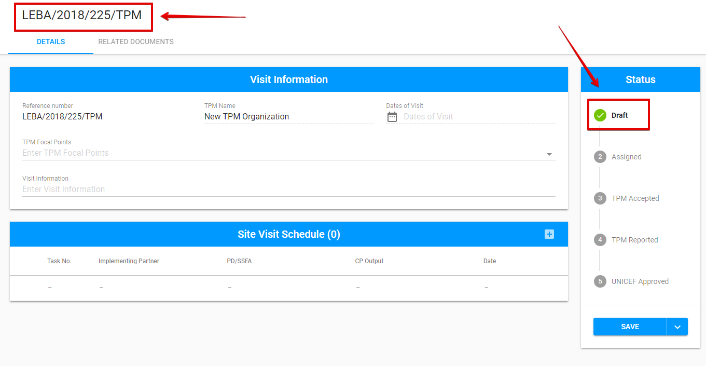

# List of Visits

Here is the overall user interface for filterable List of Visits:

 Each row can be **sorted by columns** in either ascending or descending order.

 Displayed rows in the table can be **limited per page**. The default is 10 rows per page.

Each row can be expanded via the arrow to open additional details:

## Add New Visit

User can add new Visit via "Add New Visit" button placed in the upper right-hand corner of the screen:

The following modal window is opened after the user clicked the "Add New Visit" button. 

When the TPM organization is selected from the drop-down list, the user can click the "Add" button to create new Visit.

Created Visit has the reference number displayed at the top of the screen and its status is "[Draft](statuses-and-actions/draft.md)" and displayed in the Status panel on the right side of the screen:

## Export

The List of Action points can be exported to **CSV** file by **"Export"** button in the upper, right-hand corner.

The user is able to choose the level of exporting data to CSV file.  There are 4 possible variants: 

* Location level
* Tasks Level
* Visit Level
* Action Points

  

