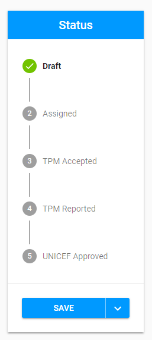

# Statuses and corresponding actions

The overall user interface for status panel is: 

There are 5 statuses displayed by default and represented for the compulsory flow of Visit: 

* [Draft](draft.md)
* [Assigned](assigned.md)
* [TPM Accepted](tpm-accepted.md)
* [TPM Reported](tpm-reported.md)
* [UNICEFF Approved](unicef-approved.md)

The 3 additional statuses are displayed if the corresponding action was performed:

* [Cancelled](cancelled.md)
* [TPM rejected](tpm-rejected.md)
* [Sent Back to TPM](sent-back-to-tpm.md)

Click on the each status provided above to open the more information of the possible actions depending on the **user role** \(PME/TPM Focal Point\). 

 

