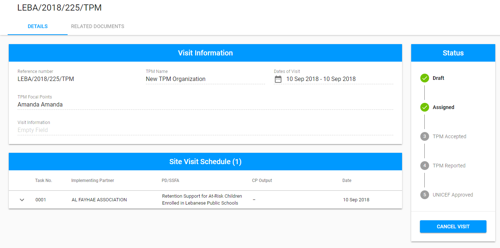
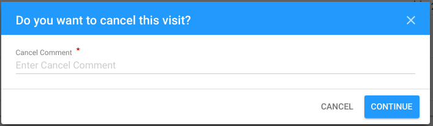
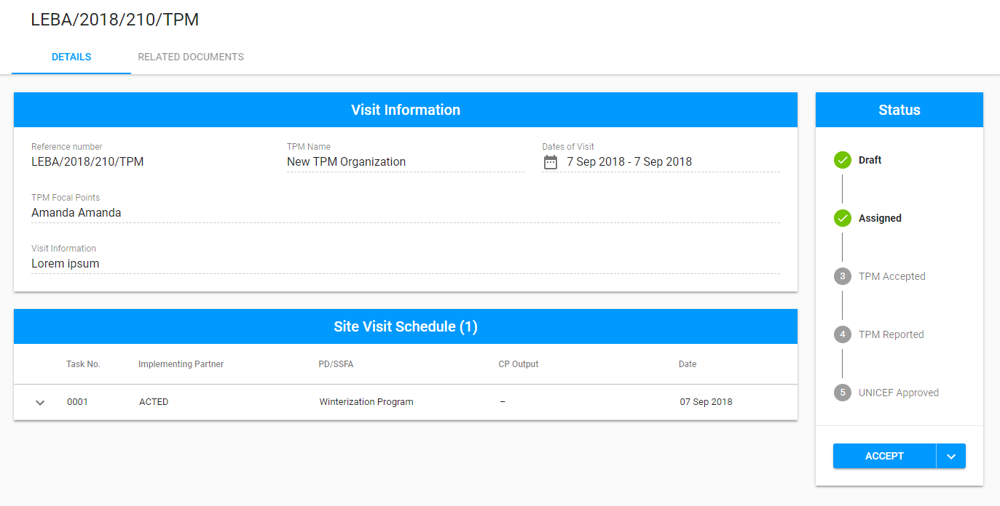
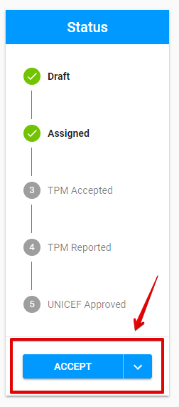
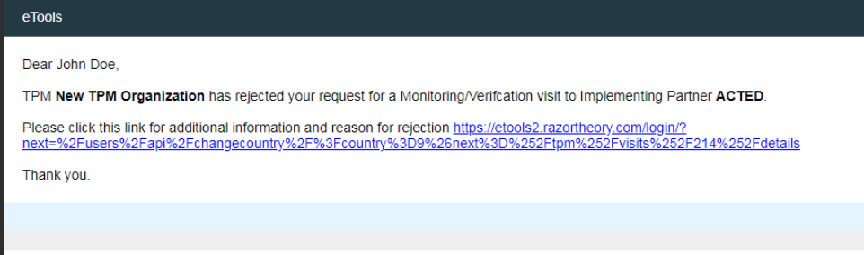

# Assigned

The "Assigned" status appears after PME assigns the visit in "Draft" status or re-assigns the visit in ["TPM Rejected"](tpm-rejected.md) status.

Click on each tab below to open the detailed information about available options for visit in "Assigned" status in according to the user role: 



Here is the overall UI for visit in "Assigned" status for PME:

### Available options 

There is "**Cancel Visit**" button placed at the bottom of the status panel:

### Cancellation 

Clicking "Cancel Visit" button takes user to the following modal window where the user has to enter cancellation reason:

The screen for visit in ["Cancelled"](cancelled.md) status is opened after clicking "Continue" button in the modal window.



Here is the overall UI for visit in "Assigned" status for TPM Focal Point:

### Available options 

There is split button "Accept" at the bottom of the status panel:

Clicking the arrow behind the button will open the additional **"Reject"** option**:** 

### **Acceptation**

Clicking the "Accept" button moves user to the screen for visit in "[TPM Accepted](tpm-accepted.md)" status.

### **Rejection**

Clicking the "Reject" button moves user to the following modal window where the user has to enter rejection comment: 

The screen for visit in "TPM Rejected" status is opened after clicking "Continue" button in the modal window.

### Email notifications

The **email notifications** are sent to PME and UNICEF Focal Point after the TPM rejects the visit. See the example of email for PME:

See more details about email notification flow [here.](../emails-notifications-flow.md)   



