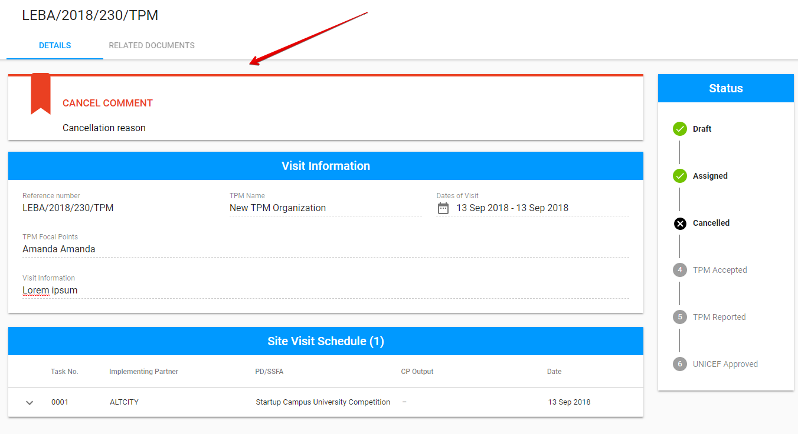

# Cancelled

The "Cancelled" status appear after the visit cancellation. 

The visit cancellation can be performed by PME in the following statuses:

* [Draft](draft.md)
* [Assigned ](assigned.md)
* [TPM Accepted ](tpm-accepted.md)

Here is the overall user interface for visit in "Cancelled" status 


UI is the same for PME and TPM Focal Point.


The ****additional **"Cancel comment"** panel appears above the "Visit Information" section. There is a PME comment displayed in this panel.

## Available options

There are no available options for visit in "Cancelled" status both for PME and TPM Focal Point. 

