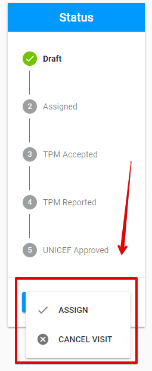

# Draft

The "Draft" status appears after the PME adds new visit via "Add New Visit" button. See more information about adding new visit in the ["How to add new Visit?"](../how-to-add-new-visit.md) article.

Click on each tab below to open the detailed information about available options for visit in "Draft" status in according to the user role: 



Here is the overall UI for visit in "Draft" status for PME:

### Available options 

There is a split button **"Save"** in the bottom of the status panel. 

Clicking the arrow behind the button opens the additional options **"Assign"** and **"Cancel visit"**:

### Editing and saving changes

The visit in "Draft" status can be edited by **PME**. See more details of user rights in the [User rights and permissions](../../overview/user-rights-and-permissions.md) article.

The user can save changes by clicking "Save" button. 

### Assigning 

Clicking "Assign" button moves user to the screen for visit in ["Assigned"](assigned.md) status.

### Email notifications

The following **email notifications** are sent to the TPM Focal point and corresponding Third Party Monitor after assigning the visit:


The similar email notifications are sent after PME re-assigns the visit in ["TPM Rejected](tpm-rejected.md)" status.


See more details about email notification flow [here.](../emails-notifications-flow.md)

### Cancellation 

Clicking "Cancel Visit" option takes user to the following modal window where the user has to enter cancellation reason:

The screen for visit in ["Cancelled"](cancelled.md) status is opened after clicking "Continue" button in the modal window.



TPM Focal Point has no access to the visit in "Draft" status.

See more information of the user rights and permissions[ here](../../overview/user-rights-and-permissions.md).



