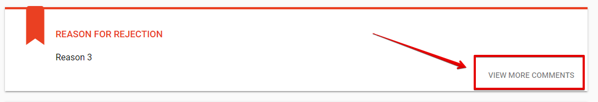
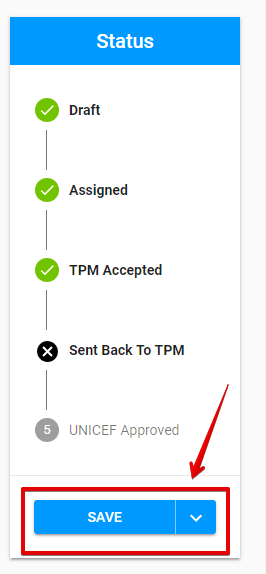

# Sent Back to TPM

The "Sent Back to TPM" status appears after the PME rejects the visit in "[TPM Reported](tpm-reported.md)" status.

The other name for this status is **"TPM Report Rejected"**, which is used in the List of Visits section after filtering by "Sent Back to TPM" status. 

Click on each tab below to open the detailed information about available options for visit in "Sent Back to TPM" status in according to the user role: 



Here is the overall UI for visit in "Sent Back to TPM" status for PME:

The ****additional **"Reason For Rejection"** panel appears above the "Visit Information" section. There is a PME comment displayed in this panel. 

In case of repeated rejections the user is able to see the previous comments by clicking the "View More Comments" option. This option is represented in the lower, right-hand corner of the new panel.  

The  user is able to view previous comments  in the following modal window:

### Available options

There are no available options for PME.



Here is the overall UI for visit in "Sent Back to TPM" status for TPM Focal Point:

The ****additional **"Reason For Rejection"** panel appears above the Visit Information section. There is a PME comment displayed in this panel. 

In case of repeated rejections the user is able to view previous comments by clicking the "View More Comments" option. This option is represented in the lower, right-hand corner of the new panel.  

The user can view previous comments in the following modal window:

### Available options

There is split button "Save" at the bottom of the Status section.

Clicking the arrow behind the button opens the additional option "Submit Report":

**Visit Letter option:** See more information about this option in the [Visit Letter](../visit-details-scree-overall-interface/visit-letter.md) article.

### Editing 

TPM Focal Point can edit the "**Report"** tab for visit in "Sent Back to TPM" status. 

The data can be saved by clicking "Save" button. 

### Submitting

Clicking "Submit report"  takes user to the the screen for visit in "[TPM Reported"](tpm-reported.md) status.

  

  



