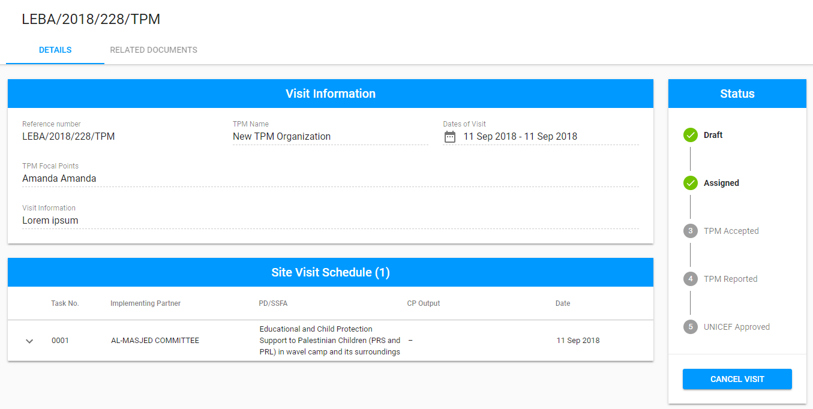
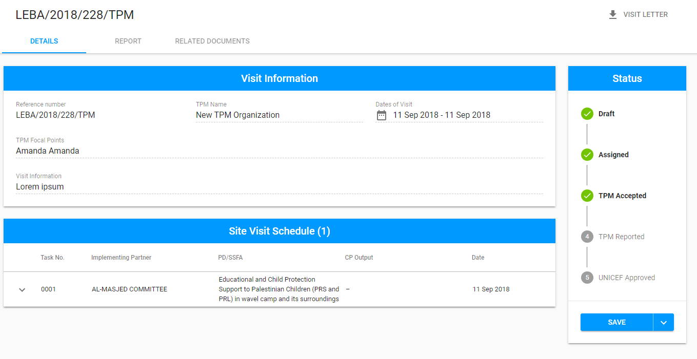
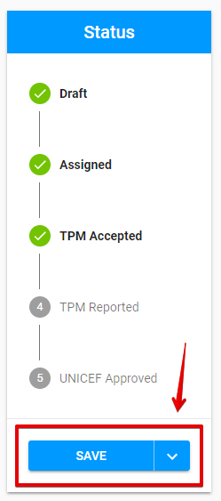
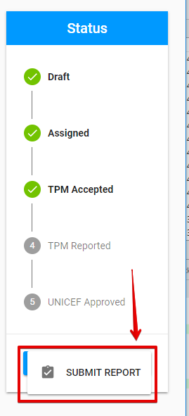

# TPM Accepted

The "TPM Accepted" status appears after the TPM Focal Point accepts the visit, which is [assigned](assigned.md) to him.  

Click on each tab below to open the detailed information about available options for visit in "TPM Accepted" status in according to the user role: 



Here is the overall UI for visit in "TPM Accepted" status for PME:

### Available options

There is **"Cancel Visit"** button at the bottom of the Status panel.

## Cancellation

Clicking "Cancel Visit" button takes user to the following modal window where the user has to enter Cancellation reason:

The screen for visit in ["Cancelled" ](cancelled.md)status is opened after clicking "Continue" button in the modal window.

###  



Here is the overall UI for visit in "TPM Accepted" status for TPM Focal Point:


**"Report"** tab and "**Visit Letter**" option appear on this screen for TPM Focal Point. 

See more details of the Report tab and Visit Letter option in the ["Visit details screen: overall UI"](../visit-details-scree-overall-interface/) article.


### Available options

There is split button "Save" at the bottom of the Status panel. 

Clicking the arrow behind the button opens the additional option **"Submit Report":**

**Visit Letter option:** See more information about this option in the "[Visit Letter](../visit-details-scree-overall-interface/visit-letter.md)" article. 

### Editing 

TPM Focal Point can edit the "**Report"** tab for visit in "TPM Accepted" status.

The data can be saved by clicking "Save" button. 

### Submitting

Clicking "Submit report"  takes user to the the screen for visit in ["TPM Reported"](tpm-reported.md) status.

### Email notifications

The email notifications are sent to the PME and UNICEF Focal Point after the TPM submits the final report. See the example of email for PME:

See more details about email notification flow [here.](../emails-notifications-flow.md) 

  



