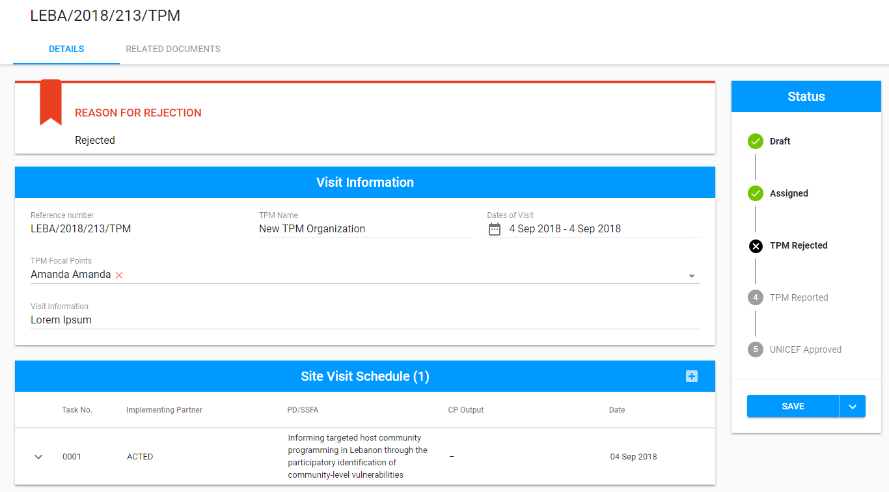
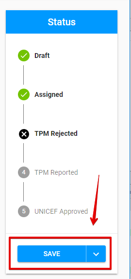
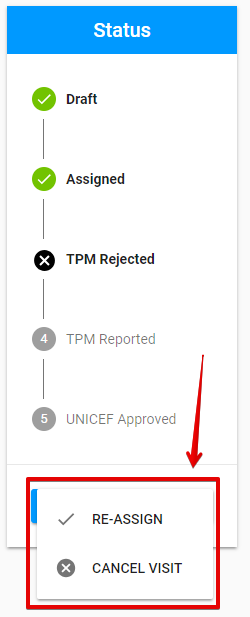
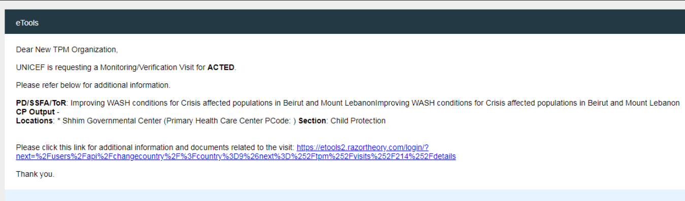
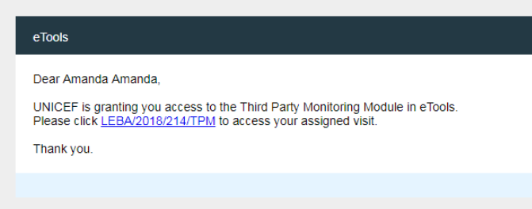
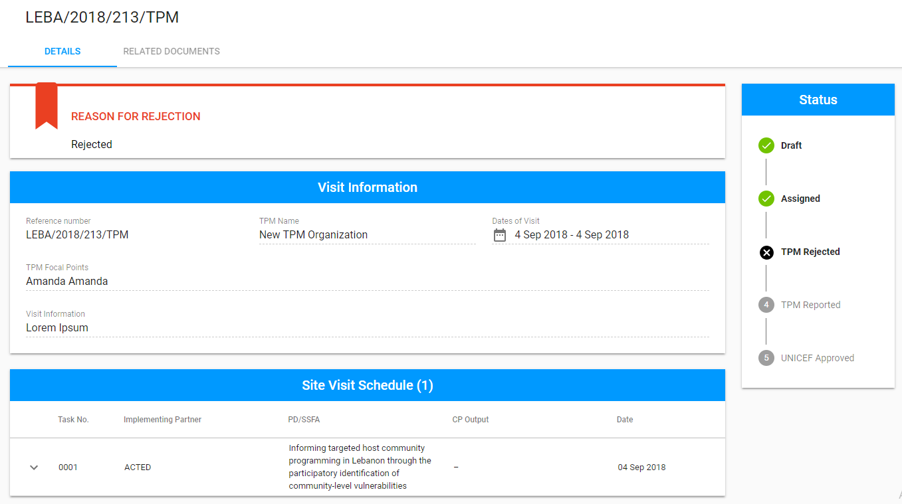

# TPM Rejected

The "TPM Rejected" Status appears after the TPM Focal Point rejects the visit that is [assigned ](assigned.md)to him.

Click on each tab below to open the detailed information about available options for visit in "TPM Rejected" status in accordance with the user role: 



Here is the overall UI for visit in "TPM Rejected" status for PME:

The ****additional **"Reason For Rejection"** panel appears above the "Visit Information" section. There is a TPM Focal Point's  comment displayed in this panel.

### Available options

There is split button "Save" at the bottom of the Status panel. 

Clicking the arrow on the button opens the additional options **"Re-Assign"** and **"Cancel Visit":**

### Editing and Saving changes

The visit in "TPM Rejected" status can be edited by PME. See more details of user rights in the [user rights](https://razortheory.gitbook.io/third-party-monitoring-module-documentation/~/edit/drafts/-LOHe8TNV4ZlgxytZ1vr/product-end-user-documentation/overview/user-rights-and-permissions)  article.

The user can save changes by clicking "Save" button. 

### Re-Assigning

Clicking "Re-Assign" takes user to the the screen for the Visit in ["Assigned"](assigned.md) status.

### Email notifications

The **email notifications** are ****sent to the TPM Focal point and corresponding Third Party Monitor after the PME re-assigns the visit. 

These notifications are similar to the [emails notification](https://razortheory.gitbook.io/third-party-monitoring-module-documentation/product-end-user-documentation/list-of-visits-section/statuses-and-actions/draft#email-notifications) sent after the PME assigns the visit in ["Draft](draft.md)" status: 

See more details about email notification flow [here.](../emails-notifications-flow.md)

### Cancellation

Clicking "Cancel Visit" option takes user to the following modal window where the user has to enter cancellation reason:

The screen for visit in ["Cancelled"](cancelled.md) status is opened after clicking "Continue" button in the modal window.

\*\*\*\*



Here is the overall UI for visit in "TPM Rejected" status for TPM Focal Point:

The ****additional **"Reason For Rejection"** panel appears above the "Visit Information" section. There is a TPM Focal Point's  comment displayed in this panel.

### Available options

There are no available options for TPM Focal Point. 



