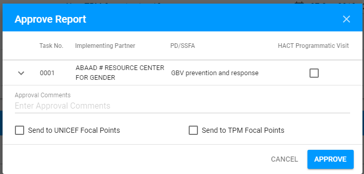

# TPM Reported

The "TPM Reported" status displayed after the TPM Focal Point submits the report for the Visit in ["TPM Accepted"](tpm-accepted.md) status.

Click on each tab below to open the detailed information about available options for visit in "TPM Reported" status in accordance with the user role: 



Here is the overall UI for visit in "TPM Reported" status for PME:


**"Report"** and "**Action Points"** tabs appear on this screen for PME. See more details on these tabs in the ["Visit details"](../visit-details-scree-overall-interface/) article. 


### Available options

There is split **"Save"** button placed at the bottom of the status panel. 

Clicking the arrow on the button opens the additional options **"Approve"** and **"Send back to TPM"**:

### Editing and saving changes 

PME and UNICEF Focal Point can edit "**Action points"** tab for the Visit in "TPM Reported" status.

The data can be saved by clicking the "Save" button.

### Approval

Clicking the "Approve" button opens the following modal window:

The screen for vist in[ "UNICEF Approved"](unicef-approved.md) status is opened after clicking "Approve" button in the modal window.

### Email notifications

The **email notifications** are sent to TMP Focal Point and UNICEF Focal Point after the PME approves the visit. See the example for TPM Focal Point:

### Sending Back To TPM

Clicking  "Send Back To TPM" opens the following modal screen:

In case of repeated rejection the PME is able to see the previous reasons for rejections in the modal window. 

This information is presented in the "Older comments" section right below the "Reason for Rejection" field:

The screen for visit in ["Sent Back to TPM"](sent-back-to-tpm.md) status appears after clicking the "Send Back To TPM" button. 

### Email notifications

The following **email notification** is sent to TMP Focal point after the PME rejects the visit:




Here is the overall UI for visit in "TPM Reported" status for TPM Focal Point:

### Available options

There is only "**Visit Letter"** option accessible for TPM Focal Point.

See more information about this option in the [Visit Letter](../visit-details-scree-overall-interface/visit-letter.md) article. 

  



