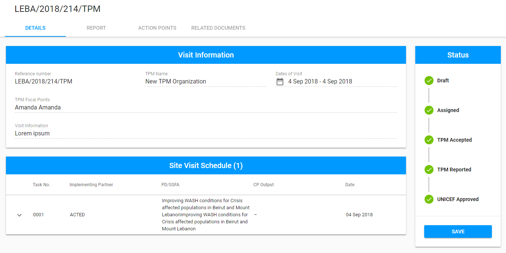
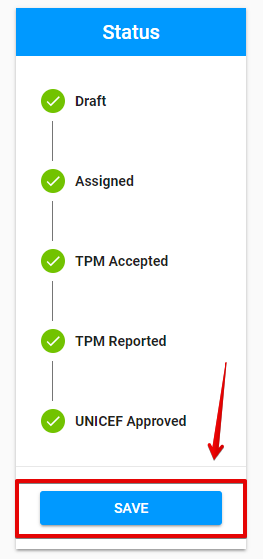
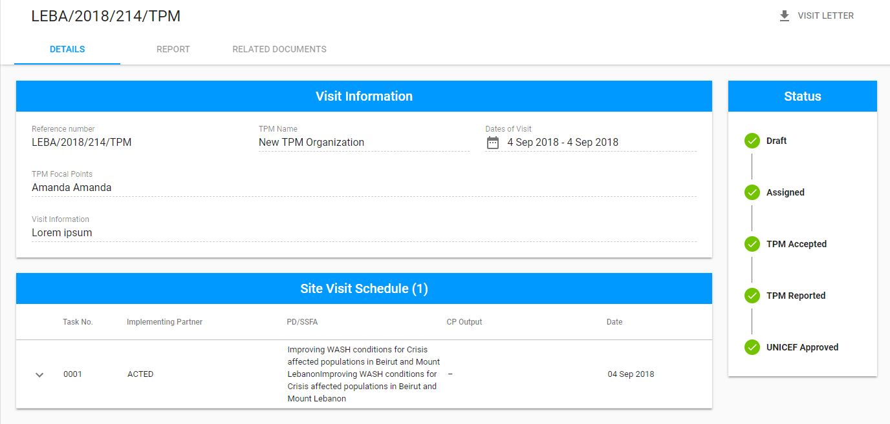

# UNICEF Approved

The "UNICEF Approved" status appears after the PME approvs the Visit in ["TPM Reported"](tpm-reported.md) status.

Click on each tab below to open the detailed information about available options for the Visit in "TPM Accepted" status in accordance with the user role: 



Here is the overall UI for Visit in "UNICEF Approved" status for PME:

### Available options

There is "Save" button at the bottom of the Status panel. 

### Editing and saving changes

The PME and UNICEF Focal Point are able to edit "**Action Points**" tab for the Visit in "UNICEF Approved" status.

The data can be saved by clicking "Save" button. 



Here is the overall UI for visit in "UNICEF Approved" status for TPM Focal Point:  

### Available options

There is only "**Visit Letter"** option accessible for TPM Focal Point.

See the details of this option in the[ Visit Details](https://razortheory.gitbook.io/third-party-monitoring-module-documentation/~/edit/drafts/-LOHe8TNV4ZlgxytZ1vr/product-end-user-documentation/list-of-visits-section/visit-details-scree-overall-interface). 



