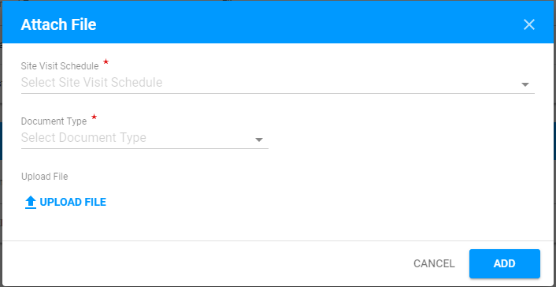
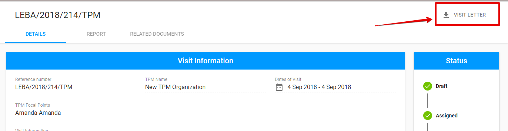

# Visit details

Here is the overall UI for the Visit details screen:

## Visit Details Tabs

Visit Details consists of the following tabs:

* Details
* Report
* Action Points
* Related Documents

Description of these tabs can be found below \(click on each tab below to open the detailed information about each Visit Details tab\):



Here is the overall UI for the Details tab: 


This tab can be edited by **PME user** in accordance with the corresponding[ user rights.](../overview/user-rights-and-permissions.md) 


This section consists of two sections:

* **Visit Information** 
* **Site Visit Schedule**

## **Visit Information section**

Here is the overall UI of this section:


This section is editable when the status of visit is **"Draft"** 


In this section user can see the information about Visit reference number, TPM Name and Dates of Visit. User can assign Visit to the TPM Focal Points using the corresponding drop=down list and write any comments regarding the Visit. 

## Site Visit Schedule section

New Task for Visit can be added via "+" button in the upper right-hand corner of the section: 

The following window is opened after the user clicks on the "+" button:

Each row can be expanded using the arrow in order to quickly see Task details:

Each Task can be edited or deleted via the "Edit" or "Delete" buttons correspondingly \("Edit" and "Delete" buttons appear after user hover the mouse over the particular line from the Site Visit Schedule list\):

There is an additional option for duplicating the task at the end of each row behind the "Edit" button \("Duplicate" button appears after user hover the mouse over the particular line from the Site Visit Schedule list\):


This section is editable when the status of visit is **"Draft".**




Here is the overall UI for the Report tab:


This tab is accessible to **TPM Focal Point** after the visit was accepted.

The **PME** has the access to this tab after the TPM Focal Point has submitted the Report for the Visit.

More details of user rights can be found in the [User rights and permissions](../overview/user-rights-and-permissions.md) article.


This section consists of **Related Documents** section and **Reports by Task** section.

## Related Documents section

User can attach new document via "+" button in the upper right-hand corner:

The following modal window is opened after the user clicks "+" button:

Attached files can be edited or deleted via "Edit"  or "Delete" button correspondingly \("Edit" and "Delete" buttons appear after user hover the mouse over the particular line from the Related Documents list\):

## Reports by Task

Adding reports is available in the following modal window opened via "+" button:

Each row can be expanded using the arrow in order to quickly see the Report details:

Report can be deleted via "Delete" option which is available when user opens the Report details:

  



Here is the overall UI for Action points tab:


This tab is editable by **PME** and **UNICEF Focal Point** after TPM Focal Point has submitted the Final Report.

TPM users has no access to this tab.

See more details of the user rights in the [User rights and permissions ](../overview/user-rights-and-permissions.md)article.


New action point can be added via "+" button in the upper right-hand corner:

The following modal window is opened after user clicks "+" button:

Action points can be edited and duplicated via "Edit" or "Duplicate" buttons correspondingly \("Edit" and "Duplicate" buttons appear after user hover the mouse over the particular line from the Action Points list\):

User can click on the reference number for the particular action point to go to the corresponding Action Point details screen in the Action Point Dashboard.

See more details of the Action Points in the [Action Point Dashboard Documentation](https://razortheory.gitbook.io/action-points-dashboard/).



Here is the overall UI for this tab:


This tab can be edited by **PME only** while the status of visit is **"Draft".**


User can attach New Document using the "+" button that opens the following modal window:

Each row can be expanded using the arrow in order to quickly see the Attachment details:

User can delete the Attachment in this section using the "Delete" option in the Attachment details:




## Status panel 

See the detailed information of the possible statuses and actions [here](statuses-and-actions/).

## Visit Letter option \(available for TPM Focal Point\)

The **TPM Focal Point** is able to download the Visit Letter with general information about the Visit. 

Download is accessible  by clicking the **"Visit Letter"** button in the upper right-hand corner of the [Visit Details screen.](visit-details-scree-overall-interface.md)

Here is the example of the Visit Letter:


The Visit Letter option is available for TPM Focal Point user after the Visit was **accepted**. 


