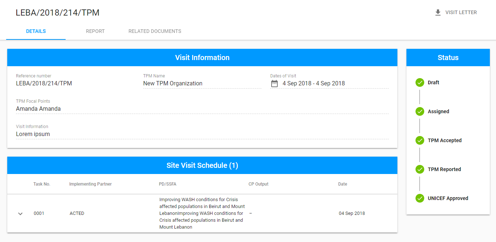

# Visit details

Here is the overall user interface for the Visit details screen:

The overall UI consists of the following **tabs**: [Details](details-tab.md), [Report](report-tab.md), [Action Points](action-points-tab.md), [Related Documents](related-document-tab.md). More details of these tabs can be found in the corresponding articles.

## Status panel 

See the detailed information of the possible statuses and actions [here](../statuses-and-actions/).

## Visit Letter option \(available for TPM Focal Point\)

The detailed information on this option is provided [here](visit-letter.md).

