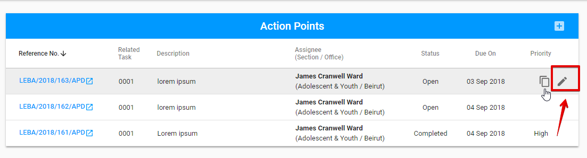
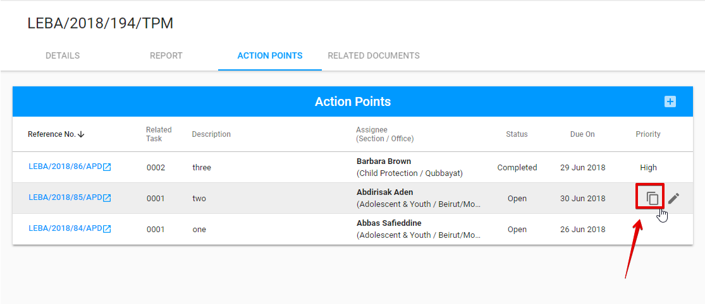

# Action Points tab

Here is the overall UI for Action points tab:


This tab is editable by **PME** and **UNICEF Focal Point** after TPM Focal Point has submitted the Final Report.

TPM users has no access to this tab.

See more details of the user rights in the [User rights and permissions ](../../overview/user-rights-and-permissions.md)article.


New action point can be added via "+" button in the upper right-hand corner:

The following modal window is opened after user clicks "+" button:

Action points can be edited and duplicated via "Edit" or "Duplicate" buttons correspondingly:

User can click on the reference number for the particular action point to go to the corresponding Action Point details screen in the Action Point Dashboard.

See more details of the Action points in the [Action Point Dashboard Documentation](https://razortheory.gitbook.io/action-points-dashboard/).

