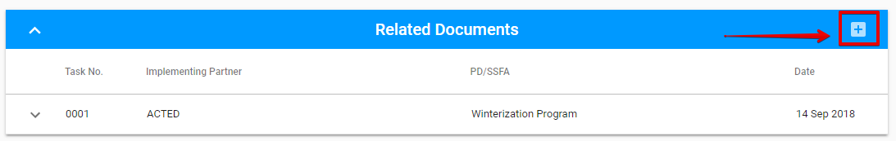
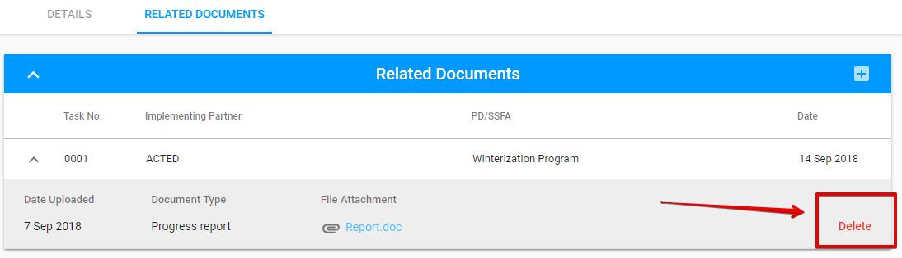

# Related Document tab

Here is the overall UI for this tab:


This tab can be edited by PME **only** while the status of visit is **"Draft".**


Attaching New Document is accessible in the following modal window which is opened via "+" button:

Each row can be expanded via the arrow. The additional details will be opened after clicking the arrow:

The data in this section can be deleted via the "Delete" option which is accessible after expanding the row:

  

