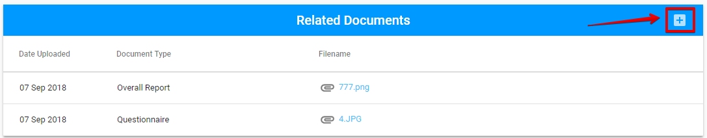
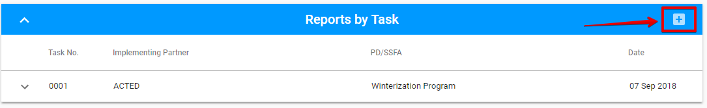

# Report tab

Here is the overall UI for the Report tab:


This tab is accessible to **TPM Focal Point** after the visit was accepted.

The **PME** has the access to this tab after the TPM Focal Point submitted the report for the visit.

The more details of user rights can be found in the ["User rights and permissions"](../../overview/user-rights-and-permissions.md) article.


This section consists of **Related Documents** section and **Reports by Task** section.

## Related Documents section

Attaching new document is available via "+" button in the upper, right-hand corner:

The following modal window is opened after the user clicks "+' button:

Attached files can be edited or deleted via "Edit"  or "Delete" button accordingly:

## Reports by Task

Adding reports is available in the following modal window opened via "+" button:

Each row in this section is expandable via the arrow. The additional details will be opened after clicking the arrow. 

The task can be deleted via "Delete" option which is available after expanding the row:

  

