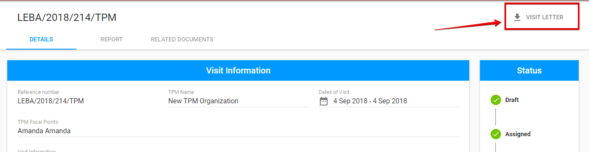
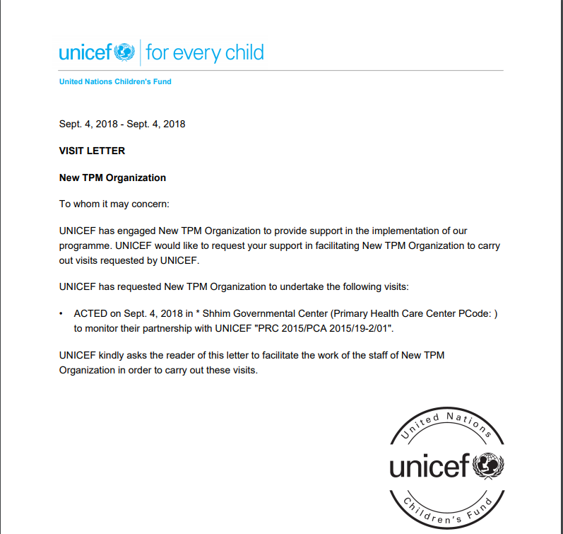

# Visit Letter

The **TPM Focal Point** is able to download the Visit Letter with general information about the Visit. 

Download is accessible  by clicking the **"Visit Letter"** button in the upper right-hand corner of the [visit details screen.](./)

Here is the example of the Visit Letter:


The Visit Letter option is available for TPM Focal Point user after the Visit was **accepted**. 


