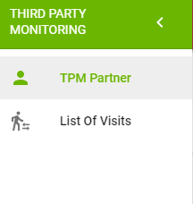

# Overall User Interface

The overall UI for Third Party Monitoring Module is presented in the following screenshot:

The following sections are represented for overall UI:

**Header** with:

* reload icon,
* profile dropdown,
* country workspace,
* app icon to switch to another application or repository.

**Сollapsible left navigation panel** with:

At the top:

* label with the module name,
* Third Party Monitors section,
* List of Visits section.


**TPM User** sees slightly different left navigation panel: there are TPM Partner and List of Visits sections. 


  
 At the bottom:

* eTools Community Channels \("Knowledge Base", "Discussion", "Information"\)

