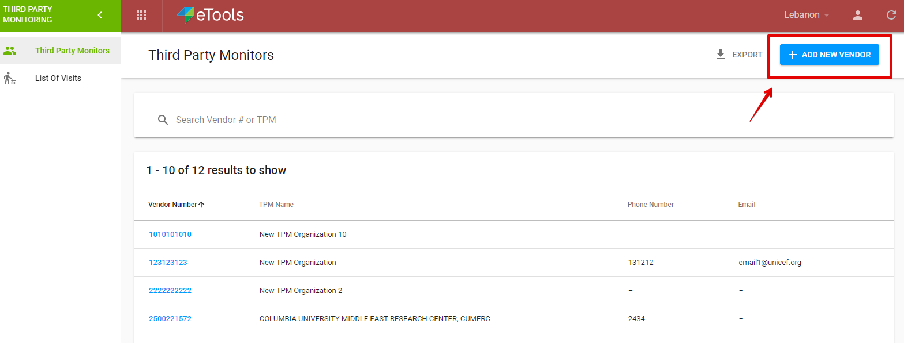
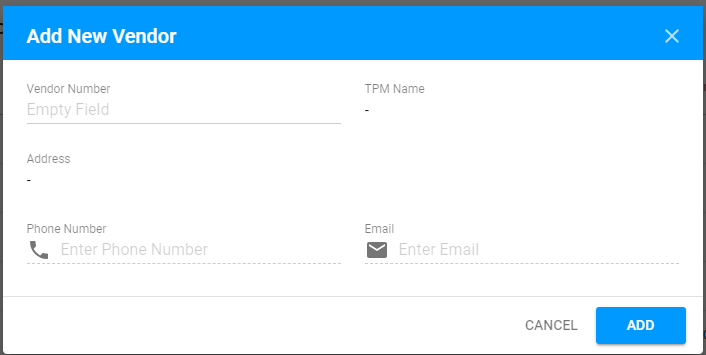
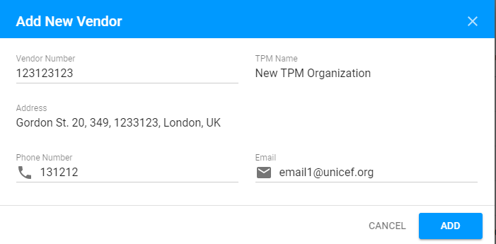

# How to add new Vendor?

Adding new Vendor is available via "Add new Vendor" button placed in the upper, right-hand corner of the Third Party Monitors screen.

When the button is clicked, the following modal window is displayed to the user:

The "Vendor number" field is editable. 

The remaining part of field is filled in automatically after the user enters Vendor number.

Clicking the "Add" button in the lower, right-hand corner of the modal window will move the user to the corresponding [TPM Partner details screen](tpm-partner-details-screen/).


Adding new Vendor is available for **PME**. See more details about user rights in the following [article](../overview/user-rights-and-permissions.md). 


