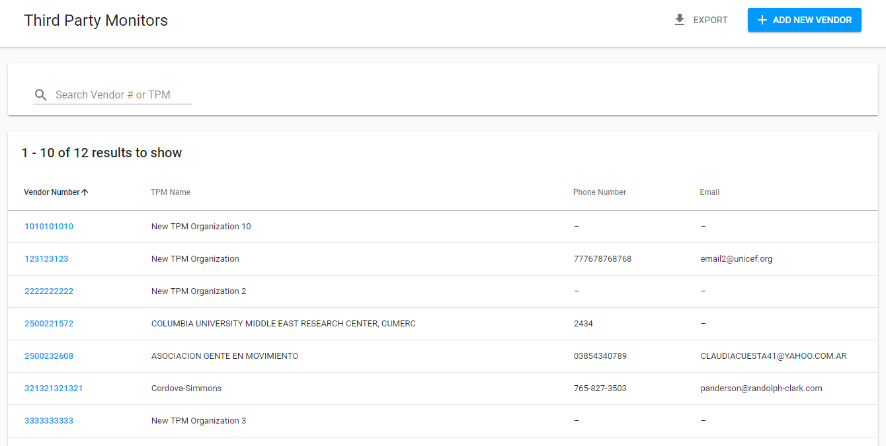
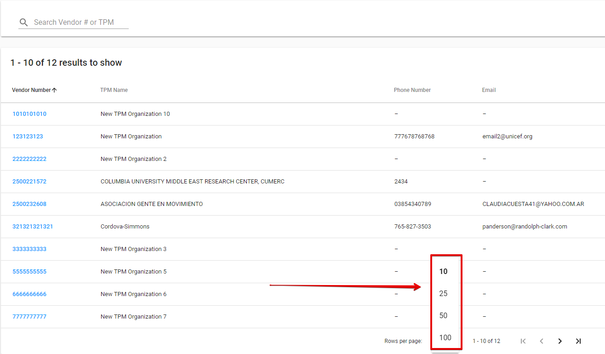
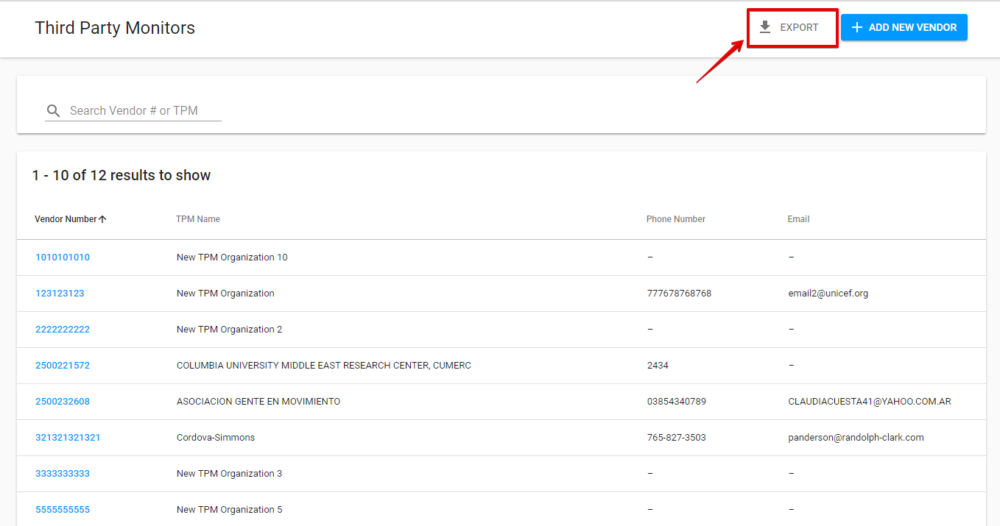
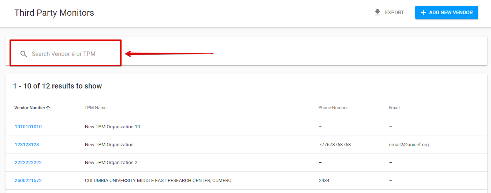

# List of Third Party Monitors

Here is the overall user interface for the list of TPM Organizations:

 Each row can be **sorted by columns** in either ascending or descending order.

User can choose the **number of the displayed Action Points per page**, it can be selected in the following dropdown field \(the default value is 10 rows per page\):

Clicking the Vendor number for the particular row will take user to the corresponding [TPM partner details screen](tpm-partner-details-screen/). 

##  Export

The List of Third Party Monitors can be exported to **CSV** file using the "Export" button in the upper right-hand corner.

## Searching

 User can search through the list using the search bar in the upper, left-hand corner:

