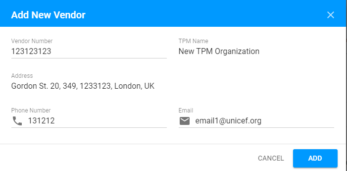

# List of Third Party Monitors

Here is the overall user interface for the list of TPM Organizations:

 Each row can be **sorted by columns** in either ascending or descending order.

User can choose the **number of the displayed Action Points per page**, it can be selected in the following dropdown field \(the default value is 10 rows per page\):

Clicking the Vendor number for the particular row will take user to the corresponding [TPM partner details screen](tpm-partner-details-screen.md). 

## Add New Vendor

User can add new Vendor is available via "Add New Vendor" button, placed in the upper right-hand corner of the Third Party Monitors screen.

The following screen is opened after the user clicks this button:

The "Vendor number" field is editable. 

The remaining fields are filled in automatically after the user enters the Vendor number.

Clicking the "Add" button in the lower right-hand corner of the modal window will move the user to the corresponding [TPM Partner details screen](tpm-partner-details-screen.md).


Adding new Vendor is available for **PME**. See more details about user rights in the following [article](../overview/user-rights-and-permissions.md). 


##  Export

The List of Third Party Monitors can be exported to **CSV** file using the "Export" button in the upper right-hand corner.

## Searching

 User can search through the list using the search bar in the upper, left-hand corner:

