# TPM partner details screen

Here is the overall user interface for TPM Partner details screen. Depending on the [user rights](../overview/user-rights-and-permissions.md), the user will see different screens:

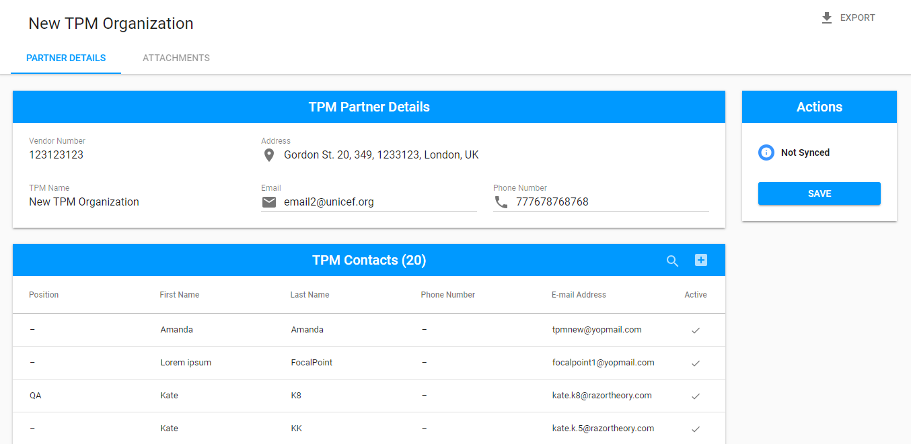

The name of the TPM Partner is displayed in the upper left-hand corner. 

There are 3 sections in the Partner Details tab: TPM Partner Details section, TPM Contacts section and Actions section. 

## TPM Partner Details section

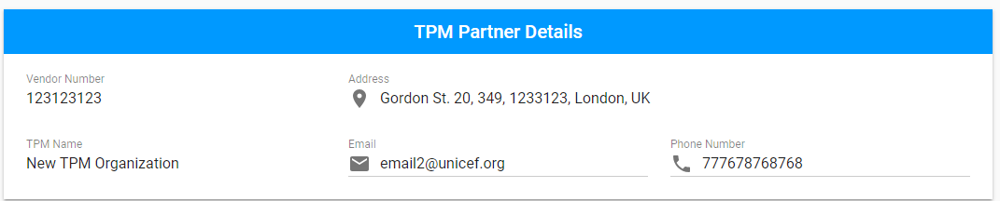

This section is editable in accordance with the [user rights](../overview/user-rights-and-permissions.md).

## TPM Contacts section

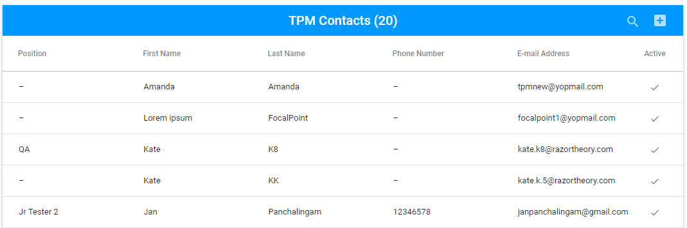

User can add new TPM Contact in the following modal screen opened via "+" button: 

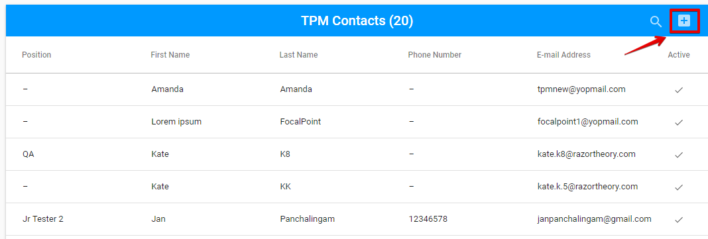

The data in this section can be edited via the "Edit" icon, which appears at the end of each row on the mouse hover. 

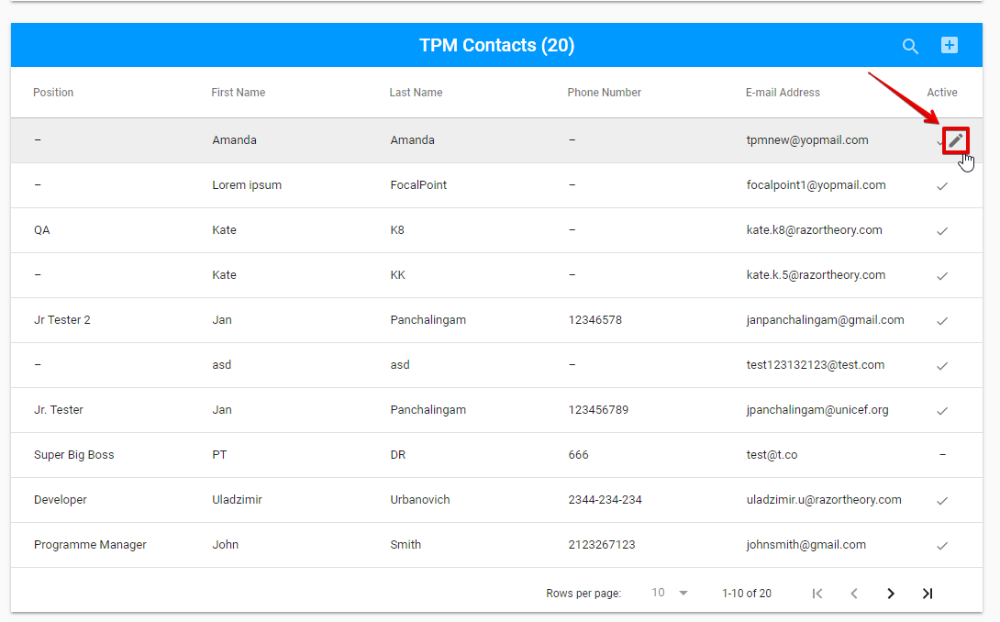

The user can  search in this list using the "Search" icon in order to perform data search. The "Search" icon is placed behind the "Edit" button: 

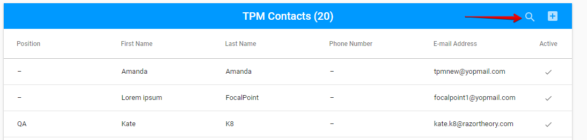

## Actions Section

This section represents the **Partner's status** in VISION. See the definition of "VISION" [here](../../introduction/glossary-terminology.md).

Partner's status can be "Synced from VISION", "Blocked in VISION", "Not Synced". 

See the example below: 

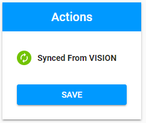

The button "Save" is displayed at the bottom of the panel and provides saving changes of Partner's information. 


The "Actions" section is available only for **PME**.


## **Exporting**

TPM Partner details can be exported to **CSV** file via "Export" button in the upper right-hand corner.

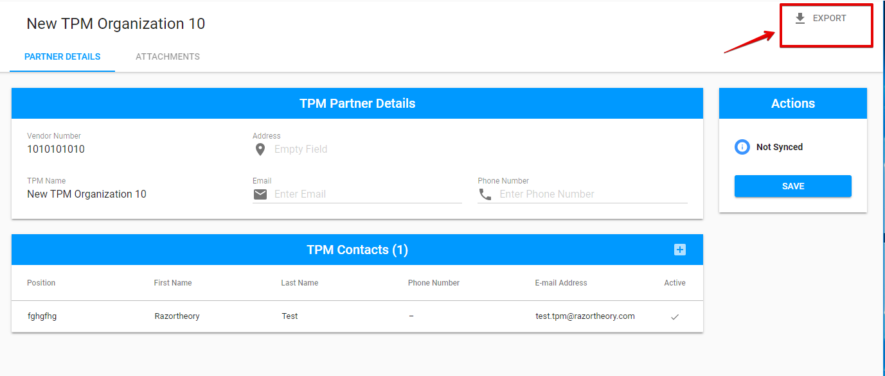

## Attachments tab

Here is the overall UI of Attachments tab:

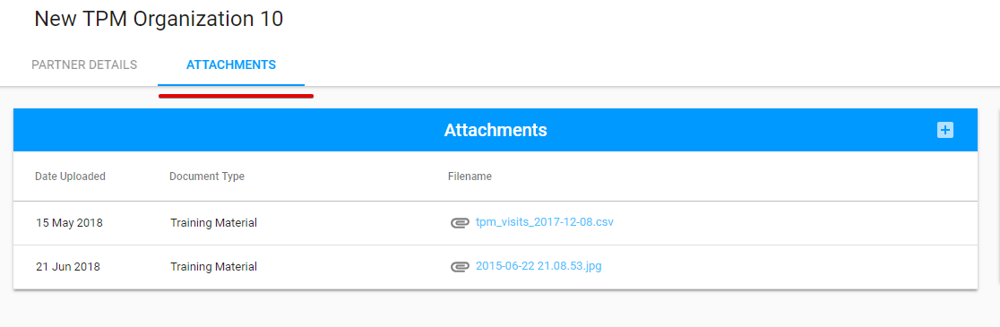

The Attachment can be added via "+" button in the upper, right-hand corner:

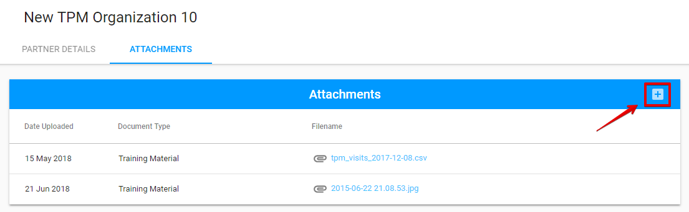

The following modal window is opened after clicking the "+" button:

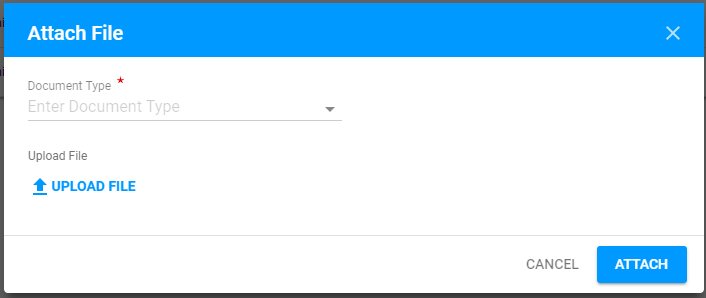

Attached files can be edited or deleted via "Edit" or "Delete" button accordingly  \("Edit" and "Delete" buttons appear after user hover the mouse over the particular line from the Attachments list\):

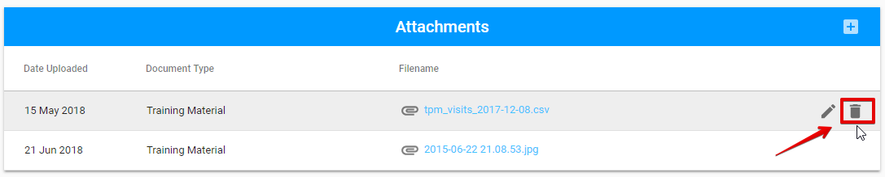

