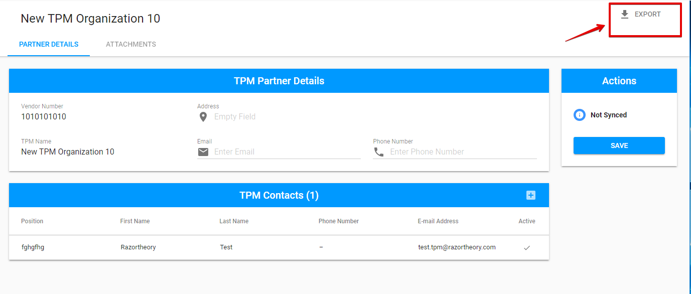

# TPM partner details screen

Here is the overall user interface for TPM Partner details screen. Available options are represented in according with the [user rights.](../../overview/user-rights-and-permissions.md) 

The name of the TPM Partner is displayed in the upper, left-hand corner. 

The overall user interface for TPM Partner details screen consists of [Partner Details tab](partner-details-tab.md) and [Attachments tab](attachments-tab.md). See more details of this tabs in the corresponding articles. 

## **Exporting**

TPM Partner details can be exported to **CSV** file via "Export" button in the upper, right-hand corner.

