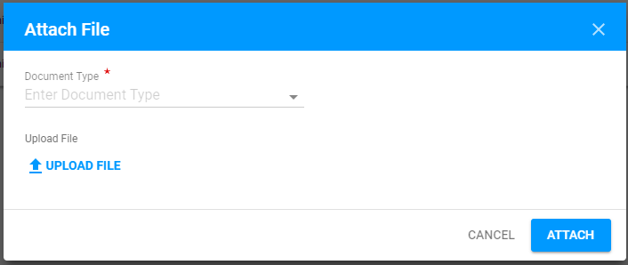
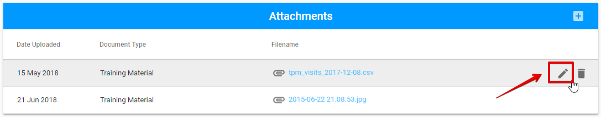

# Attachments tab

Here is the overall UI of Attachments tab:

The Attachment can be added via "+" button in the upper, right-hand corner:

The following modal window is opened after clicking the "+" button:

Attached files can be edited or deleted via "Edit" or "Delete" button accordingly:

