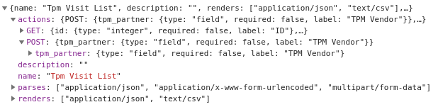
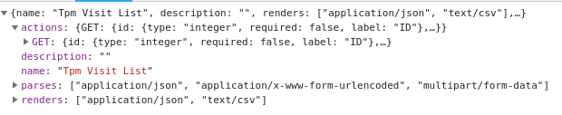
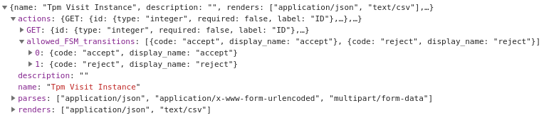

# API Metadata

As far as we use dynamic list of fields in every specific case, we've reworked existing rest framework metadata mechanism \(OPTIONS requests\). By default only editable fields are shown here, so for clear understanding of current situation, viewable fields were added inside GET action \(`unicef_restlib.metadata.CRUActionsMetadataMixin`\). When fields lists are prepared, they can be filtered using permissions with `etools.applications.utils.permissions.metadata.PermissionsBasedMetadataMixin`. Also, transitions set can vary depending on the permissions, so they also should be available in the metadata. `etools.applications.permissions2.PermittedFSMTransitionActionMetadataMixin` was designed to do this. Additionally, transitions can be renamed on the fly using `name` in custom attribute of transition. For example:

```python
custom={ 'name': _('Cancel Visit') }
```

or lambda function

```python
custom={    
    'name': lambda obj: _('Re-assign') if obj.status == TPMVisit.STATUSES.tpm_rejected else _('Assign')
}
```

 If none is provided, function name will be used as the display name in the metadata.

So here is an example of the metadata class that can correctly communicate with permissions and correctly display information about the availability of each field.

```python
class ExampleMetadata(
    CRUActionsMetadataMixin,
    PermissionsBasedMetadataMixin,
    PermittedFSMTransitionActionMetadataMixin,
    SimpleMetadata
):
    def get_serializer_info(self, serializer):
        if serializer.instance:
            serializer.context['instance'] = serializer.instance
        return super(TPMPermissionBasedMetadata, self).get_serializer_info(serializer)
```

Example of metadata: 



Example shows that visits could be added by partner field. If user is not allowed to create visits, POST will not appear:



Example of available instance fsm transitions:



user can either accept or reject the Visit, but can't edit any details.

