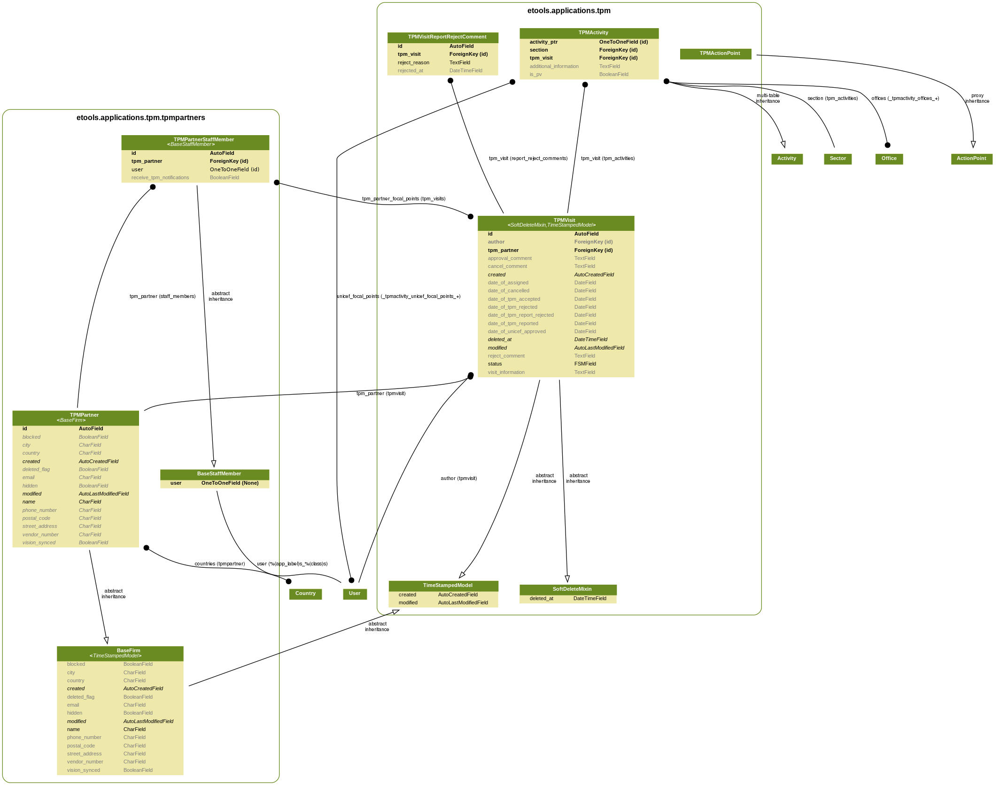

# Data Model

TPM Models structure is quite simple: we have global application \(tpmpartner\) with partner infrmation and partner agreement and country-related activities which belongs to some visit.

Attachments are connected using generic relation to visit & activities.

Action points belongs to activities.

