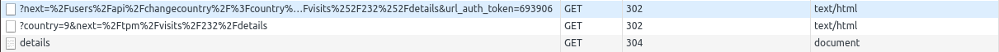

# Email links & Tokens Authorization

When we send email to the user we often send links to eTools portal.  
In some cases we also need to authorize user automatically, so there is a complex mechanism with chain of redirects to be assured that everything we need will be performed.

There is an example of such url:  
https://etools2.razortheory.com/tokens/email/login/?next=%2Fusers%2Fapi%2Fchangecountry%2F%3Fcountry%3D9%26next%3D%252Ftpm%252Fvisits%252F232%252Fdetails&url\_auth\_token=693906  
It consists of three important steps:  
1. Base url is `tokens/email/login`. This view is simply check authorization. This is very important step, because it wraps changecountry api view \(_in case of unauthorized user there will be ugly response, which is not informant enough_\). If user is authenticated \(or auth token is provided\), he will be redirected to the next step, else he will be asked to authorize and if everything is ok, he can continue to the original path. Rest part of url is coded inside `next` argument.  
2. Next is `users/api/changecountry` endpoint, which switch country to desired to be ensured user will be in correct workspace when he will attempt to open page. Again, next part of path is inside `next` argument.  
3. And, finally, we are in correct page.

Example of redirects chain:

### Tokens Authorization

Sometimes, when we want to authorize user automatically \(for example, for Third Party Monitors or Auditors\). In this case we add auth token, which is used by django middleware and authorize user without asking credentials. More information can be found in `TokenAuthenticationMiddleware` . Also, there is a view, which can be accessed by `tokens/email/login` endpoint, where user can ask newer auth token by his email. In this case `next`argument will be coded into form context and will be remembered for future usage in token renewal link.

