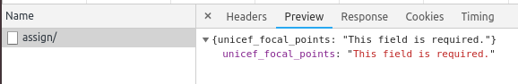

# FSM Transitions conditions

In some cases there are additional requirements to allow process to the next step. For this was built custom conditions which integrates with transitions out of the box.

Base classes for them:

* `BaseTransitionCheck` - base check which collects validation errors inside `get_errors` function and raise them if conditions are not met
* BaseRequiredFieldsCheck - has `fields` attribute which contain list of required fields to allow performing of transition

examples:

check that attachments of specific type are provided:

```python
class ReportAttachmentsCheck(BaseTransitionCheck):
    def get_errors(self, instance, *args, **kwargs):
        errors = super().get_errors(*args, **kwargs)

        if not instance.report_attachments.filter(file_type__name='report').exists():
            errors['report_attachments'] = _('You should attach report.')
        return errors
```

check partner and all required focal points are provided before visit assignment

```python
class TPMVisitAssignRequiredFieldsCheck(BaseRequiredFieldsCheck):
    fields = [
        'tpm_partner', 'unicef_focal_points', 'tpm_partner_focal_points'
    ]
```


example of error response in case of unmet conditions:




