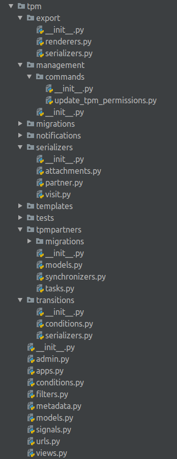

# Backend Module structure

### TPM module files structure

`export` - everything that is related to csv & pdf exports  
`management` - specific management commands \(in our case there is only one command for updating permissions\)  
`migrations` - database migrations  
`notifications` - templates for email notifications  
`serializers`- rest framework serializers  
    - `attachments.py` - visit attachments serializers  
    - `partner.py` - tpm partner serializers  
    - `visit.py` - serializers for visit, activity,   
- `templates` - templates to be used in various exports. visit letter & activities pdf export  
- `tests` - tests for models, views, serializers, transitions flow  
-  `tpmpartners` - nested global application to keep shared across the countries information about tpm firm  
- `transitions` - everything that is related to fsm transitions  
    - `conditions.py` - custom checks for transitions \(for example in case of submitting report we need to be assured that report attachments exist\)  
    - `serializers.py` - transitions serializers to validate their input arguments \(see more in [permissions framework section](permissions-framework.md#views)\)  
- `admin.py` - admin site definitions for models  
- `apps.py` - python app configuration  
- `conditions.py` - conditions for permissions framework. [see more details here](permissions-framework.md)  
- `filters.py` - rest framework views filters  
- `metadata.py` - base metadata class to be used in viewsets. more in [API Metadata section](api-metadata.md)  
- `models.py` -  country-related tpm models  
- `signals.py` - app signals. custom logic for user deletion; sending notifications in case of assigning action points  
- `urls.py` - app urls  
- `views.py` - just set of views to work with models

### tpm.tpmpartners app

To store the global data that is related to TPM,  nested application named `tpmpartners` was implemented.  
Views and serializers are still located in the parent application to keep the consistant place for all module logic.

The App consists of the following parts:  
- `migrations` - database migrations  
- `models.py` - partner with their staff members  
- `synchronizer.py` - VISION partner synchronizer  
- `tasks.py` - periodic tasks, which are responsible for keeping the partners synced with the VISION  

