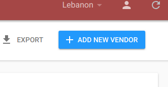
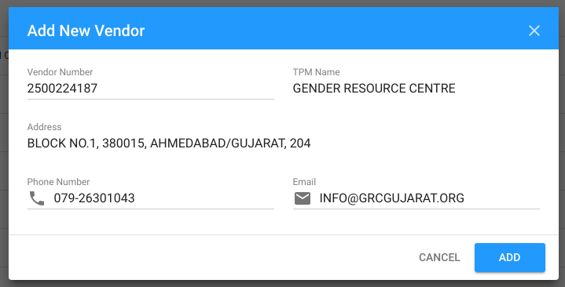

# Synchronization with VISION

VISION is an external database managed by UNICEF. We use it for fetching base partner information by vendor number.





By clicking on `add new vendor` and entering partner vendor number, call through the api will be performed. If the record not exists in database, it will be searched in VISION by the next url:   
[https://devapis.unicef.org/BIService/BIWebService.svc/GetPartnerDetailsInfo\_JSON/&lt;vendor\_number&gt;](https://devapis.unicef.org/BIService/BIWebService.svc/GetPartnerDetailsInfo_JSON/<vendor_number>)  
in case of success, partner information will be synced to the server database and then periodically refresh actual data. 

response example:

```javascript
{
  'ROWSET': {
    'ROW': {
      'CITY': 'AHMEDABAD\\/GUJARAT',
      'COUNTRY': '204',
      'DATE_OF_ASSESSMENT': '01-JAN-16',
      'EMAIL': 'INFO@GRCGUJARAT.ORG',
      'NET_CASH_TRANSFERRED_CY': '0',
      'PARTNER_TYPE': 'GOVT',
      'PARTNER_TYPE_DESC': 'Government',
      'PHONE_NUMBER': '079-26301043',
      'POSTAL_CODE': '380015',
      'REPORTED_CY': '0',
      'RISK_RATING': 'Non-Assessed',
      'SEARCH_TERM1': 'GRC',
      'STREET': 'BLOCK NO.1',
      'TOTAL_CASH_TRANSFERRED_CP': '0',
      'TOTAL_CASH_TRANSFERRED_CY': '0',
      'TOTAL_CASH_TRANSFERRED_YTD': '0',
      'TYPE_OF_ASSESSMENT': 'Micro Assessment',
      'VENDOR_BANK': {
        'VENDOR_BANK_ROW': [
          {
            'BANK_ACCOUNT_NO': '032010100483698',
            'BANK_BRANCH': 'Vastrapur',
            'BANK_COUNTRY_KEY': '204',
            'BANK_KEY': 'UTIB0000032',
            'BANK_NAME': 'AXIS BANK LTD',
            'CITY': 'GUJARAT',
            'STREET': 'SHILALEKH, NEHRU PARK CIRCLE, VASTR',
            'SWIFT_CODE': 'UTIB0000032'
          }
        ]
      },
      'VENDOR_CODE': '2500224187',
      'VENDOR_NAME': 'GENDER RESOURCE CENTRE'
    }
  }
}
```


