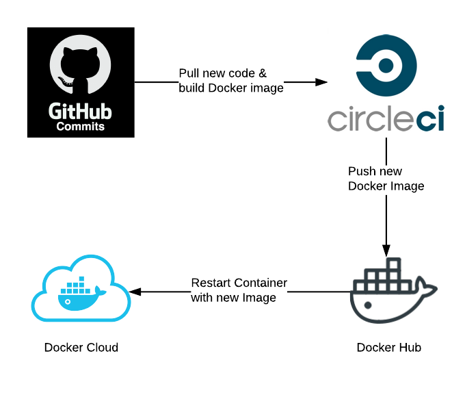

# Deployment / DevOps

From a development standpoint we follow the standard git flow doing Pull Requests \(PR's\) for changes, code review and then merging to develop \(the integration branch for testing / staging environments\) and master \(stable\) branches.

Once the code has been merged to the develop/master, it is automatically deployed to the staging/production using the following tooling/flow:

CI is done in CircleCI where images are built and tests are run. CircleCI then pushes the various images to the Docker Hub, which is then automatically picked up by the appropriate "stack" in the Docker Cloud.

Periodically during deployment update of core data & permissions is required. For more information please check [related section](fixtures-and-management-commands-todo.md).

